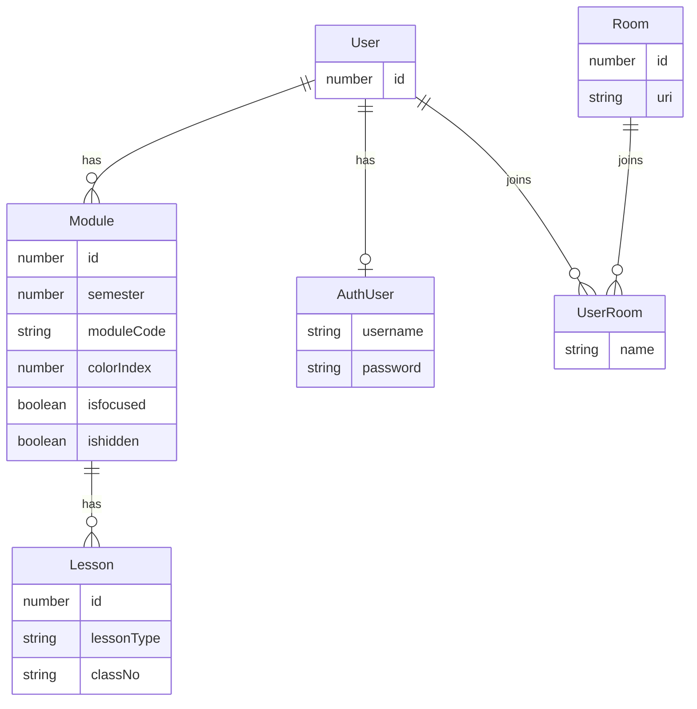

# Server

## Prerequisite

- Functional PostgreSQL Server
  - If using docker,
    `docker compose up -d` to start a PostgreSQL instance
- Change the configuration located in `.env.dev` (if necessary)

## Getting Started

Ensure that dependencies are installed

```
pnpm install
```

Create the database (dev)

```
pnpm migrate
```

Start the GraphQL server

```
pnpm start
```

Visit http://localhost:4000/graphql for Web UI

## Database Design


